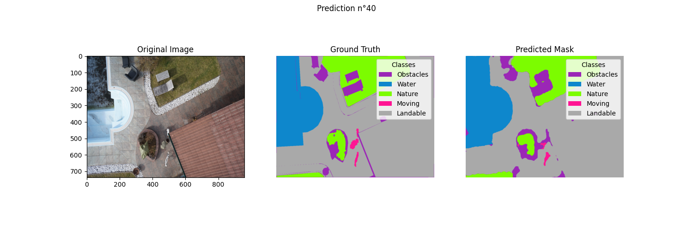
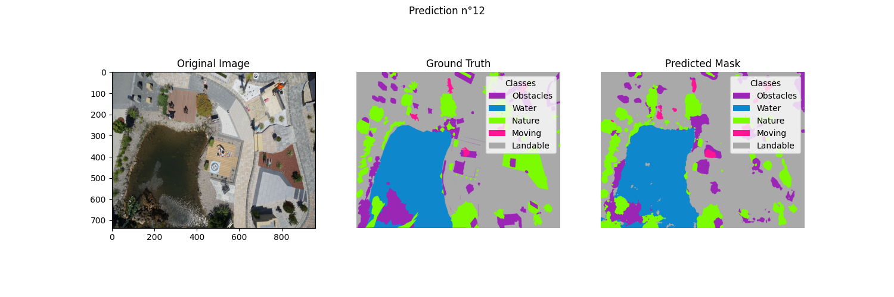

# Drone Semantic Segmentation

> Deep Learning project for binary and multiclass semantic segmentation on drone imagery.  
> Developed as part of the SICOM S9 "Acceleration Material" course.

## 📌 Overview

This repository provides a complete pipeline for semantic segmentation on drone-acquired datasets using state-of-the-art models like **UNet**, **SegFormer**, and **UFormer**.  
It supports training, evaluation, prediction visualization, and distributed training (for Gricad cluster).

---

## 📁 Project Structure

```
semantic-segmentation-drone-data/
├── doc/
│   ├── accel_mat_report_Azerine_Carron.pdf   # Final report
│   └── accel_mat_slides_Azerine_Carron.pdf   # Slides
├── src/
│   ├── python/
│   │   ├── droneDataset.py     # Dataset and preprocessing logic
│   │   ├── metrics.py          # Metrics: PA, MPA, IoU, mIoU
│   │   ├── model.py            # Model definitions (UNet, SegFormer, UFormer)
│   │   ├── trainer.py          # Training, validation, and testing logic
│   │   ├── vizualization.py    # Visualization utilities
│   ├── get_curves.py           # Plot training curves from CSV logs
│   ├── main.py                 # Train/validate/test a model
│   └── predict.py              # Generate predictions from a trained model
├── outputs/
│   ├── MultiUnet/
│   │   └── predictions.zip
│   └── SegFormer/
│       └── predictions.zip
├── config.yaml                 # Main configuration file
└── README.md                   # Project documentation
```

---

## 🚀 Getting Started

### 1. Clone the Repository

```bash
git clone https://github.com/your-username/semantic-segmentation-drone-data.git
cd semantic-segmentation-drone-data
```

### 2. Install Dependencies

Make sure you’re using **Python ≥3.8** and a virtual environment:

```bash
python -m venv venv
source venv/bin/activate  # or venv\Scripts\activate on Windows
pip install -r requirements.txt
```

---

## ⚙️ Configuration

Update the `config.yaml` file to modify:

- Dataset paths
- Model architecture (`UNet`, `SegFormer`, etc.)
- Training hyperparameters
- Output paths
- Distributed training settings

---

## 📈 Usage

### 🏋️ Train a model

```bash
python ./src/main.py
```

> Make sure `distributed::active` is disabled in `config.yaml` if running locally.

### 🔍 Make predictions

```bash
python ./src/predict.py
```

> Update the model checkpoint path in `config.yaml`.

### 📊 Plot learning curves

```bash
python ./src/get_curves.py
```

---

## 🖥️ Distributed Training on Gricad

### 🔧 Setup

1. Enable distributed training:
   ```yaml
   distributed:
     active: 1
   ```

2. Create a `.h` script with the following:
   ```bash
   export CUDA_VISIBLE_DEVICES=0,1,2,3
   torchrun --nproc_per_node=4 src/main.py
   ```

> Use `localhost` as master node (Gricad allocates it). If port conflicts occur, change it manually.

---

## 📦 Requirements

All dependencies are listed in `requirements.txt`.

Key packages include:

- PyTorch
- torchvision
- segmentation_models_pytorch
- transformers
- matplotlib / plotly
- PyYAML / pandas / PIL

---

## 📌 Notes

- Predictions and curves **must be run with distributed mode off**.
- Some models require **custom install steps** depending on your PyTorch version (e.g. for HuggingFace SegFormer).
- Set `TF_ENABLE_ONEDNN_OPTS=0` for compatibility when using CPU backends.

---

## 📷 Results

Below is a sample prediction result from the **MultiUNet** model on the drone dataset:

<p align="center">
  
</p>

> The UNet model successfully segments large and clearly defined classes such as moving objects and landable areas. However, it shows limitations with smaller or less contrasted elements, sometimes misclassifying obstacles or blending class boundaries. This result highlights UNet's solid performance in general structure recognition, but also its relative weakness in fine-grained or context-dependent segmentation tasks.

A sample prediction result from the **SegFormer** model

<p align="center">
  
</p>

> This SegFormer prediction shows robust performance on large and structured regions, especially the **water body**, which is segmented with high precision. The model also correctly identifies many surrounding **obstacles** and patches of **nature**, even in complex, cluttered urban scenery. While some minor confusion persists between **moving** and **obstacle** classes in dense zones, the overall segmentation is consistent and well-aligned with the ground truth. This reflects SegFormer's strong ability to model long-range dependencies and handle heterogeneous scenes with fine details.

---
